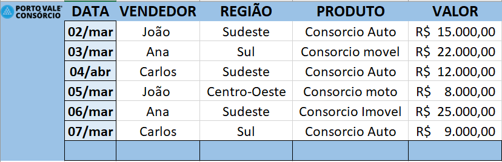
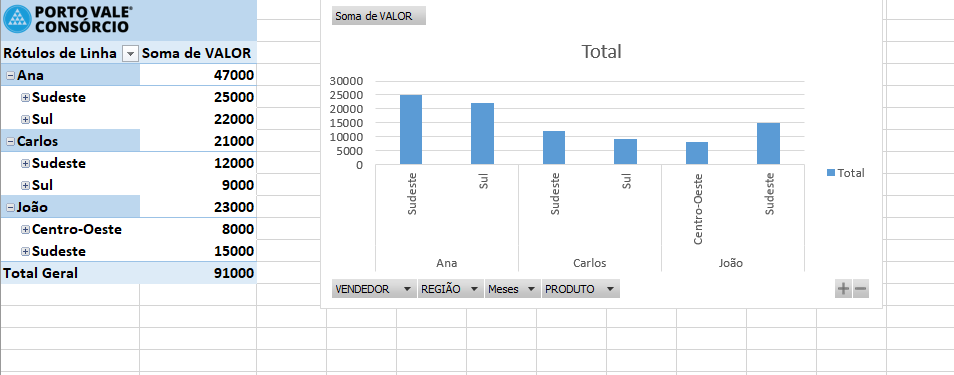
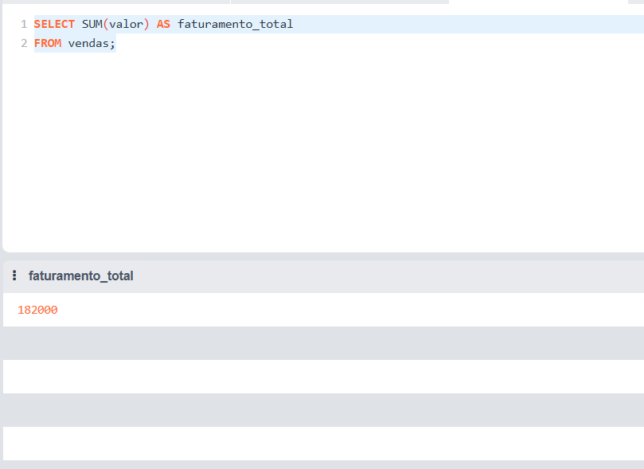
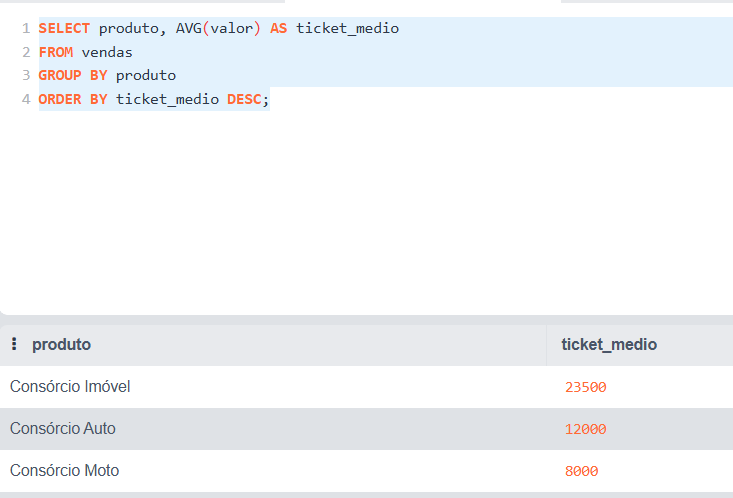
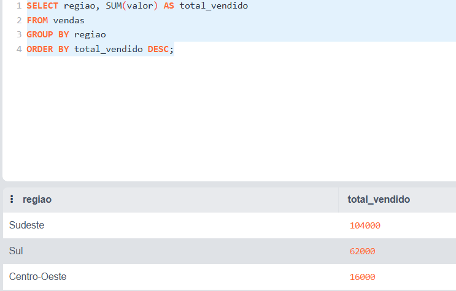
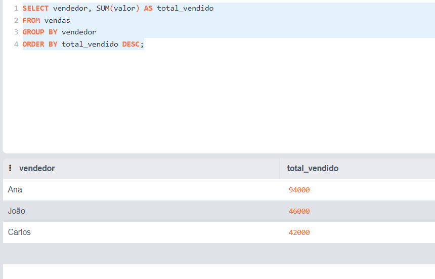

# Projeto de Análise de Inteligência Comercial

Este projeto demonstra uma análise simples de desempenho comercial utilizando **Excel** e **SQLite**.

O objetivo é simular como uma área de **Inteligência Comercial / BI** pode analisar dados de vendas para apoiar decisões de negócio.

---

# Ferramentas utilizadas

- Excel (organização da base de dados e dashboard)
- SQLite (consultas e agregação de dados)
- SQL (análise de indicadores comerciais)

---

# Base de dados

A base contém informações de vendas com os seguintes campos:

- Data
- Vendedor
- Região
- Produto
- Valor da venda

Esses dados foram utilizados para gerar indicadores de desempenho comercial.

---

# Indicadores analisados

Foram analisados os seguintes indicadores:

- Faturamento total
- Vendas por vendedor
- Vendas por região
- Ticket médio por produto

---

# Dashboard no Excel

## Estrutura da base de vendas



## Tabela dinâmica de análise



---

# Análises realizadas no SQLite

## Faturamento total



## Ticket médio por produto



## Total vendido por região



## Total vendido por vendedor



---

# Consultas SQL utilizadas

Exemplo de consulta utilizada para calcular vendas por vendedor:

```sql
SELECT vendedor, SUM(valor) AS total_vendido
FROM vendas
GROUP BY vendedor
ORDER BY total_vendido DESC;
